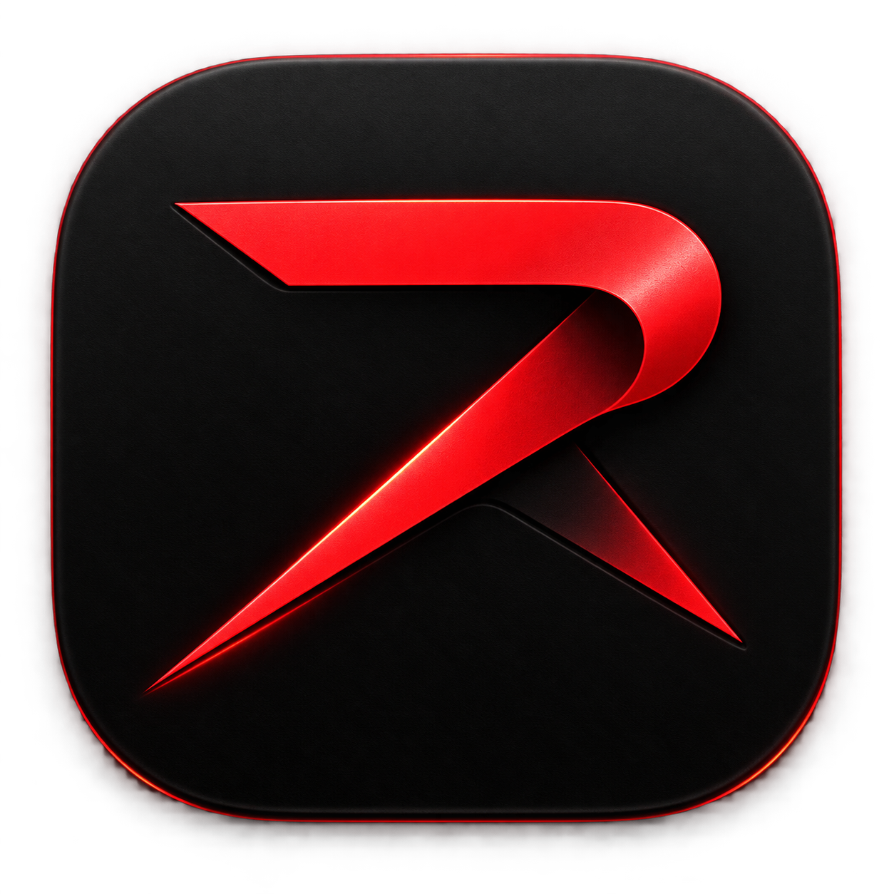
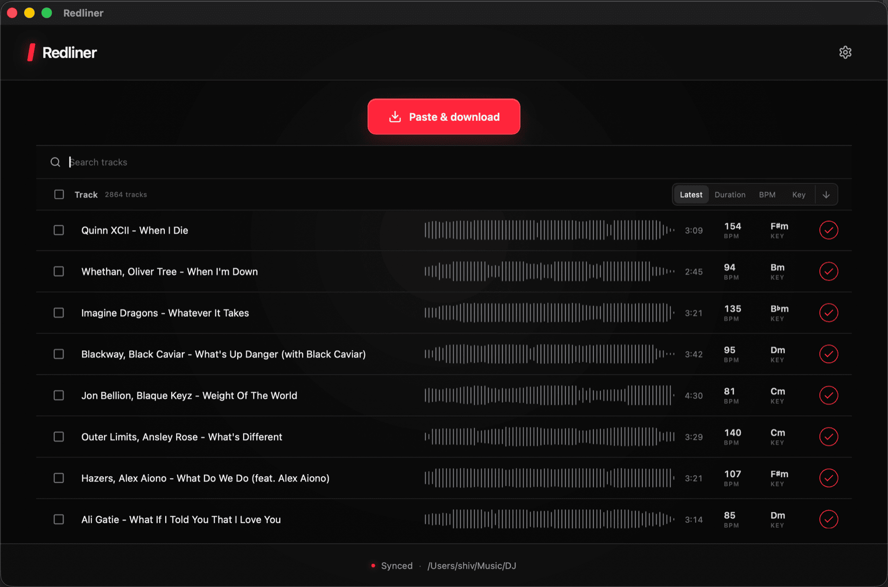
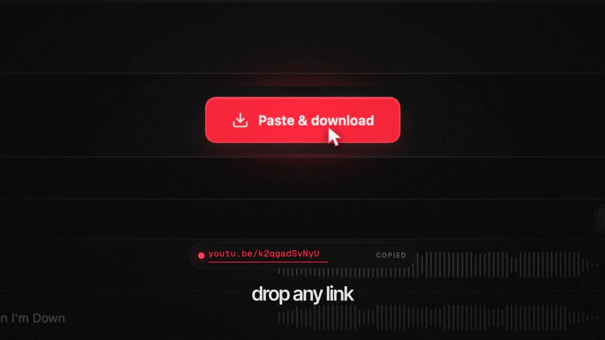

<p align="center">
  
</p>

# Redliner

Redliner is for hot knobbers and lazy DJs who need the requested song now. Drop in a YouTube, SoundCloud, Spotify, or other supported link. Redliner grabs the best audio it can find, works out the BPM and key, draws a waveform, and drops the track into your DJ software's watched folder.

Online rips can sound rough. Use a proper release when sound quality matters, and only download media you have the right to use.

Built for macOS and tested with DJUCED. Tracks stay synced with the selected folder, and you can sort, rename, reanalyze, reveal, or move them to Trash without leaving Redliner.



## Watch it work

[](assets/redliner-launch.mp4)

A request, caught in 24 seconds. Click the frame to play the launch video.

## Install

[Download the latest macOS installer](https://github.com/shiv213/redliner/releases/latest). Redliner currently ships for Apple Silicon and is not notarized, so macOS may ask you to right-click the app and choose Open the first time.

Redliner also needs `yt-dlp` and `ffmpeg`:

```sh
brew install yt-dlp ffmpeg
```

Choose your DJUCED music folder in Settings, then add the same folder to DJUCED once. Spotify links are matched to an available audio source; Redliner does not download audio from Spotify.

## Develop

```sh
npm install
npm run tauri dev
```

## Support

[Buy me a coffee](https://buymeacoffee.com/shivvtrivedi) if Redliner saves a set. Built by [Shiv Trivedi](https://shivvtrivedi.com).

MIT licensed.
